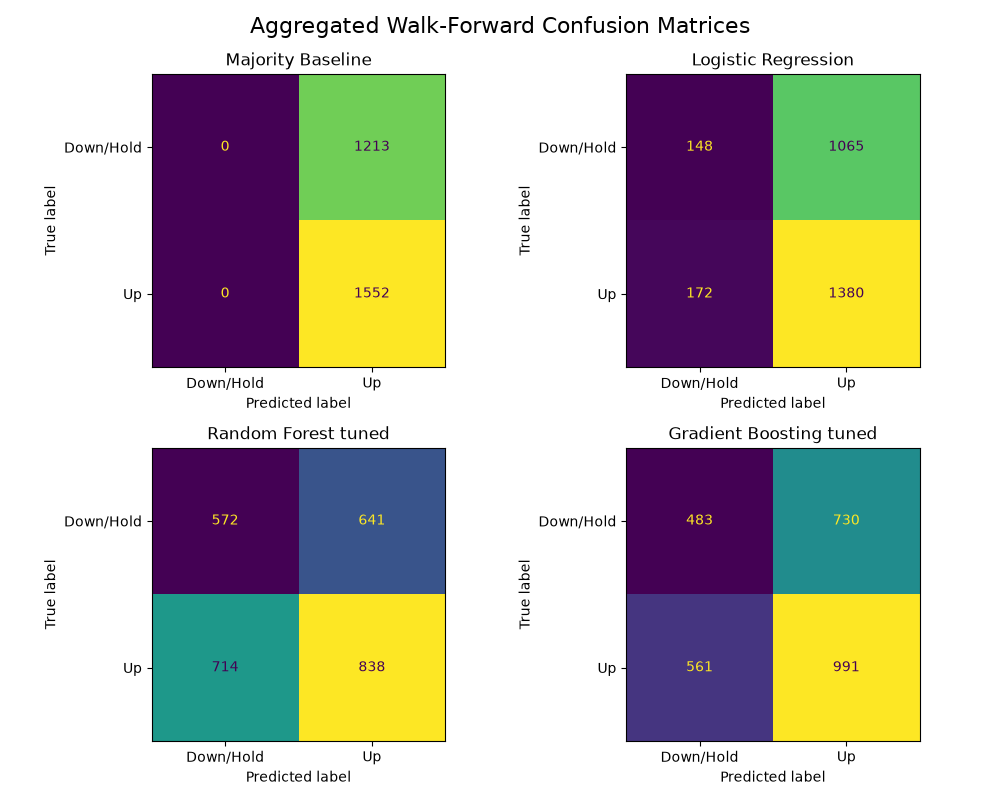
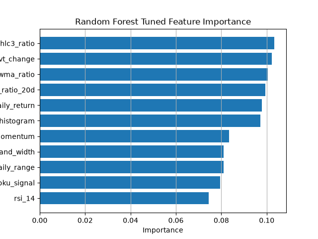
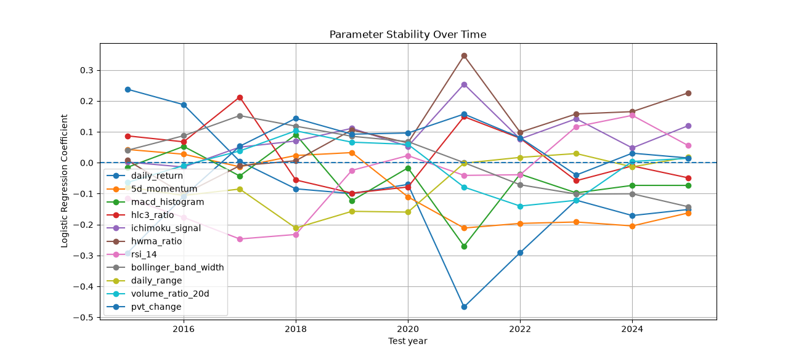

# 🤖 Machine Learning Stock Direction Classifier using Walk-Forward Validation
This project investigates whether machine learning can be used effectively to predict the next day direction of QQQ. 

I built a full supervised machine learning pipeline using OHLCV market data, engineered technical indicators, created binary direction targets, and compared multiple classification models using walk-forward validation.

Models tested include a majority-class baseline, logistic regression, random forest, and gradient boosting classifier.

This project explores the supervised learning application of ML in the context of 
the stock market, and expands the breadth and depth of my knowledge of how the theories from the classroom are used in real world applications
## Project Pipeline

1. **📊 Data collection**  
   Downloaded historical OHLCV data for QQQ.

2. **🧼 Data cleaning**  
   Sorted dates, removed duplicate rows, handled missing values, and prepared the data for modelling.

3. **🛠️ Feature engineering**  
   Created technical indicators including momentum, volatility, moving-averages, RSI, MACD, and other price/volume-based features.

4. **🎯 Target creation**  
   Created a binary target indicating whether the next trading day closed higher or lower.

5. **📈 Walk-forward validation**  
   Trained models on historical rolling windows and tested them on future yearly periods.

6. **🖥️ Model comparison**  
   Compared a majority class baseline against logistic regression, random forest, and gradient boosting.

7. **✅ Evaluation**  
   Measured accuracy, macro precision, macro recall, macro F1, confusion matrices, and feature importance.


## 🧾 Results Summary

The models were evaluated using walk-forward testing to better simulate real trading conditions. Rather than using a single random train-test split, each model was trained on a rolling historical window and tested on the following year.

| Model | Accuracy | Macro Precision | Macro Recall | Macro F1 |
|---|---:|---:|---:|---:|
| Majority Baseline |  0.561      |      0.281     |    0.500   |  0.359 |
| Logistic Regression | 0.553      |      0.512     |    0.505   |  0.436 |
| Random Forest | 0.510        |    0.515     |    0.513 |   0.501 |
| Gradient Boosting |  0.533 | 0.526  | 0.524   |  0.516 |

Although the majority-class baseline achieved the highest accuracy, this was partly due to class imbalance. The machine learning models, particularly gradient boosting, achieved stronger macro F1 scores, suggesting they made more balanced predictions across both upward and downward classes. Overall, the task remained difficult due to the noisy and non-stationary nature of short-term market movement.







## Key Findings

- Predicting short-term market direction is difficult, possibly impossible. Even when using multiple technical indicators.
- Increasing the number of indicators does not necessarily increase the predicitive quality of a model, instead, selecting the highest quality features may be a more appropriate approach.
- The quality of a feature is dependent on the type of model that uses it, logistic regression may like using moving averages, but random forests tend to value the RSI more and averages less.
- The majority-class baseline achieved the highest accuracy, showing why accuracy alone can be misleading for imbalanced classification tasks.
- Gradient boosting achieved the strongest macro F1 score, suggesting it made more balanced predictions across both classes.
- Walk-forward validation provided a more realistic evaluation method than a random train-test split because models were tested on future unseen time periods.
- Logistic regression provided a simple and interpretable baseline model.
- Random forest and gradient boosting allowed non-linear relationships between technical indicators to be tested.
- Feature importance analysis helped identify which indicators contributed most to model decisions.
- Tuning models made minimal improvements

## Limitations

- **Limited OHLCV indicators were tested**  
  Around 20 technical indicators were tested, but not every possible indicator combination, lookback window, or feature transformation was explored. Different combinations of features may produce different results.

- **The project focuses on QQQ only**  
  Since the model was tested on a single ETF, the results may not generalise to other stocks, sectors, asset classes, or market conditions.

- **Financial markets are noisy and non-stationary**  
  Relationships between technical indicators and future returns can change over time. A feature that appears useful in one period may become less useful or even misleading in another period.

- **Accuracy alone can be misleading**  
  The majority-class baseline achieved strong accuracy because one class occurred more often than the other. For this reason, macro precision, macro recall, and macro F1 were also used to evaluate whether the models were making more balanced predictions.

## Technologies

```md
- Python
- pandas
- NumPy
- scikit-learn
- matplotlib
- yfinance
- Git/GitHub
```
## How to Run

1. **Clone the repository**

```bash
git clone https://github.com/Cyrex9666/project_AI.git
cd project_AI
```
2. **Install requried libraries**
```bash
pip install -r requirements.txt
```

3. **Run the main walk forward model comparison**
```bash
python src/model_gboost_wkfwd.py
```
4. **Run Parameter Stability anlysis**
```bash
python src/model_eval_paramstb.py
```

## Personal note:
Structuring the project posed a significant challenge as I found myself consistently having to reiterate on previous work based on learning new techniques, skills, methods in industry behind ml and its uses in finance. There are still many thing I may have failed to consider